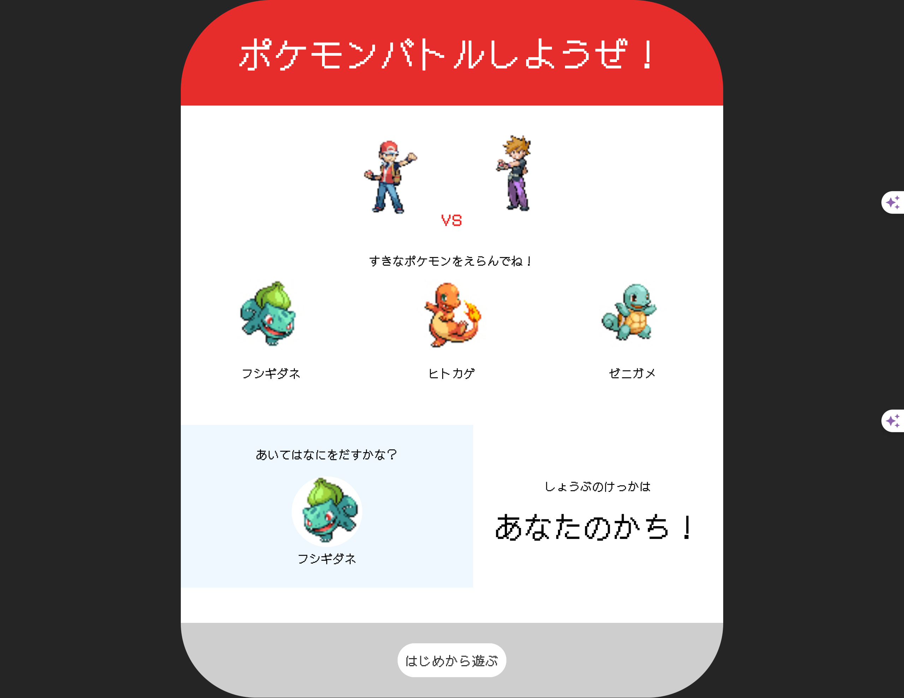
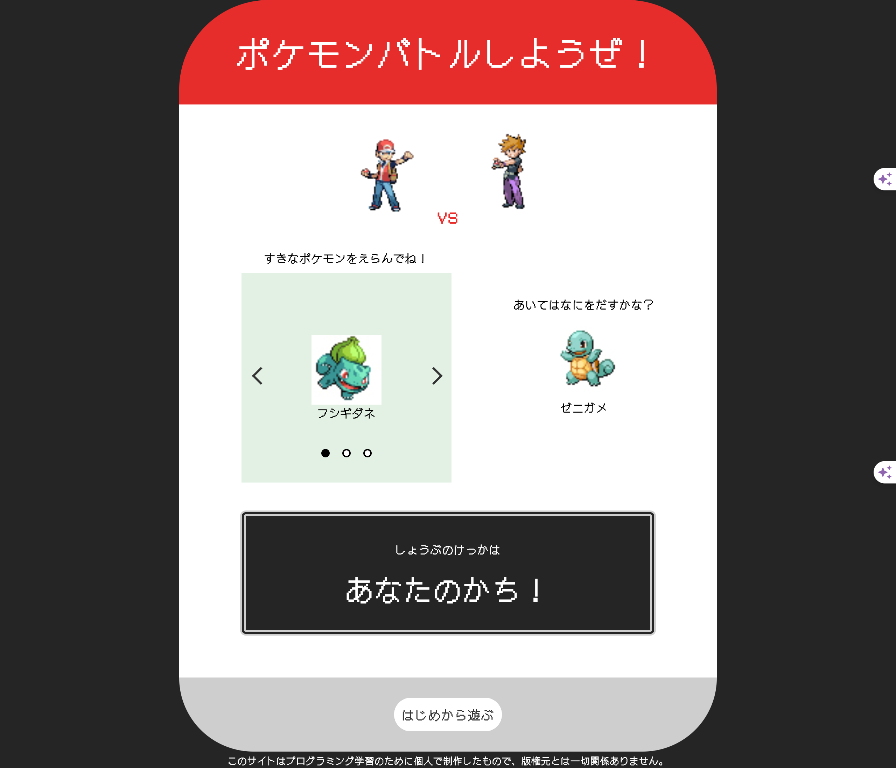

# ① 課題番号-プロダクト名

じゃんけんアプリ

## ② 課題内容（どんな作品か）

- javascript を使用したじゃんけんのアプリを制作する

## ③DEMO

なし
バージョン違いをいくつか制作しており、最新は index2.html です。

## ④ 工夫した点・こだわった点

- じゃんけんの三つ巴のシステムをポケモンに応用
- レトロゲームっぽさの表現
- ver.2(index2.html)ではより対戦っぽさが出るように配置を変更し、js でスライダーを実装しました。

## ④ 難しかった点・次回トライしたいこと(又は機能)

- ただコピペし続けてコードが助長になった気がするので、うまくまとめられるようにしたい。
- コードの意味が理解しきれていないところがあるので、具体例など調べるようにしたい。

## ⑤ 質問・疑問・感想、シェアしたいこと等なんでも

- [質問] ボタンを押したときにホバーで線がつくのですが、それによって高さが変わってガタガタするのを解消したいです。
- [疑問] js のコードを短くした方がいいのか知りたいです。
- [感想] 文字数が多くなってくるとどんどん理解が難しくなる、、と感じました、繰り返し演習で身につけたいです。
- [tips] レトロゲームっぽさを出すために音源を埋め込みました。※容量オーバーでオーディオデータをアップロードできませんでした。
- [参考記事] [オーディオの埋め込み方法](https://chocolat5.com/tips/html-audio-play/)

### おまけ（キャプチャー画像）

